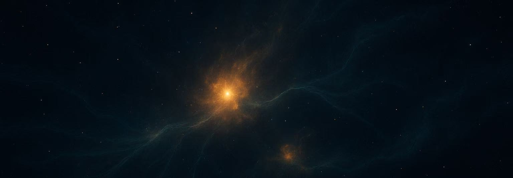

<section class="quarks-hero">
  
  

  

    
ATOMS + QUARKS

    <h1>QUARKS Survey</h1>
    
Using ALMA's sharpest eyes to explore the birthplaces of massive stars and reveal how their earliest groups assemble.

    

      QUARKS (Querying Underlying mechanisms of massive star formation with ALMA-Resolved gas Kinematics and Structures)
      follows dense star-forming protoclusters from the ATOMS sample to smaller physical scales, combining target catalogs,
      continuum products, and multi-scale image atlases to study fragmentation, core formation, gas kinematics,
      accretion flows, feedback, and the early evolution of massive star-forming regions.
    

    

      <a class="quarks-button quarks-button--primary" href="targets/">Browse Targets</a>
      <a class="quarks-button quarks-button--secondary" href="atlas/">Open Atlas</a>
    

  

</section>

<section class="quarks-overview">
  

    139
    QUARKS targets
  

  

    156
    Band 6 pointings
  

  

    ATOMS
    Band 3 survey legacy
  

  

    ~1000 au
    resolved physical scales
  

</section>

<section class="quarks-section">
  

    
Survey Scope

    <h2>Connecting clump-scale environments to the birthplaces of massive stars</h2>
  

  

    

      ATOMS established a uniform ALMA Band 3 view of active massive star-forming regions. QUARKS extends this foundation
      with higher-resolution Band 6 observations, targeting the internal structure and kinematics of dense star-forming protoclusters.
    

    

      This website is designed as the public entry point for QUARKS products: target information, continuum images and FITS
      files, source-by-source multi-scale atlases, publications, team information, and contact points for collaboration.
    

  

</section>

<section class="quarks-links" aria-label="QUARKS website sections">
  <a class="quarks-link" href="legacy/">
    Legacy
    How the ATOMS Band 3 survey motivates and supports the QUARKS Band 6 program.
  </a>
  <a class="quarks-link" href="targets/">
    Targets
    Basic source properties for the 139-object QUARKS target sample.
  </a>
  <a class="quarks-link" href="continuum/">
    Continuum
    Browse continuum images and download corresponding continuum FITS products.
  </a>
  <a class="quarks-link" href="atlas/">
    Atlas
    Multi-scale, multi-wavelength image atlas for individual sources.
  </a>
  <a class="quarks-link" href="publications/">
    Publications
    Papers and science results based on ATOMS and QUARKS observations.
  </a>
  <a class="quarks-link" href="contact/">
    Contact
    Find contact information for data questions and collaboration requests.
  </a>
</section>
